# Smartshop-EC2-INSTANCE-PROJECT

This project showcases the provisioning of EC2 instance in the AWS environment

## Setting up my EC2 instance and deployed an Apache web server

The document explains how the security group was set up, also how the EC2 instance was set up and how Apache web server was deployed on it.

### Setting Up Security Groups

• I Created a new Security Group, then put in the description as “Allow SSH and HTTP traffic”

• I selected the already created VPC titled Lita_project_vpc

• Created my inbound rule, allowing SSH and HTTP traffic from anywhere IPV4

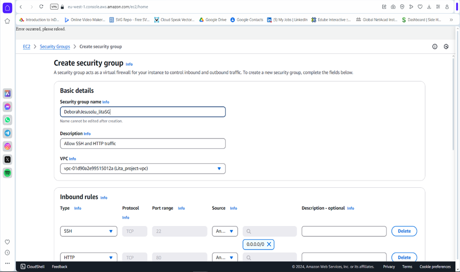

• I left the outbound rule with the default of allowing all traffic

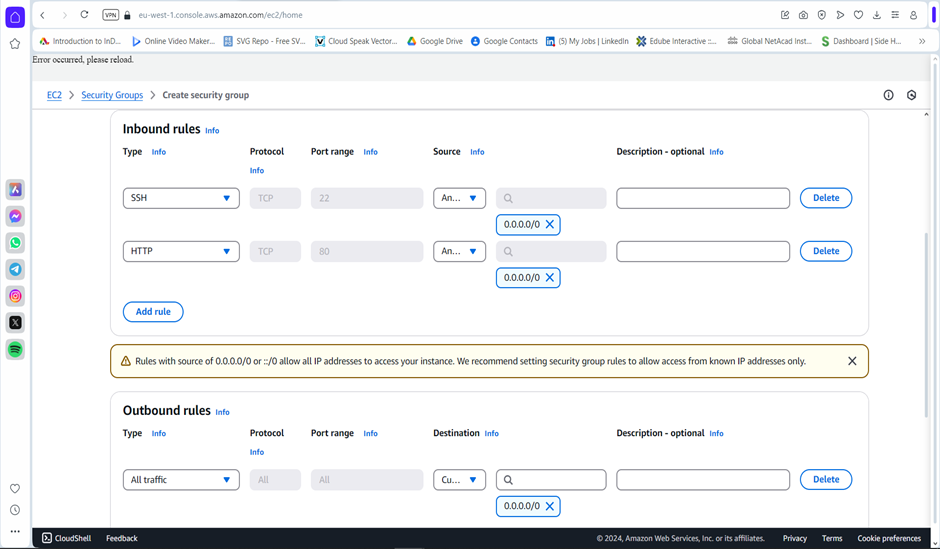

• Thereafter I clicked on create Security Group

### Launching the EC2 Instance

• I named my instance using DeborahJesusolu_lita

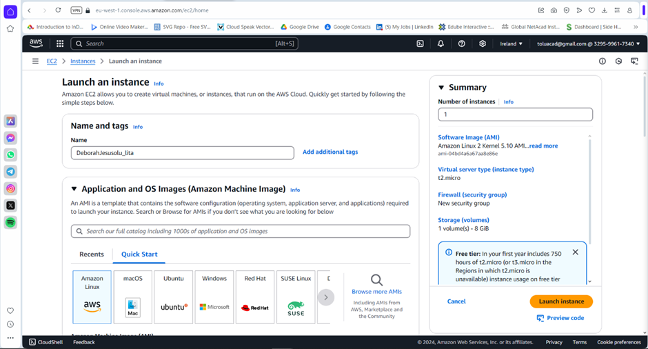

• I choose the Amazon Linux 2 AMI under the Amazon Machine Image

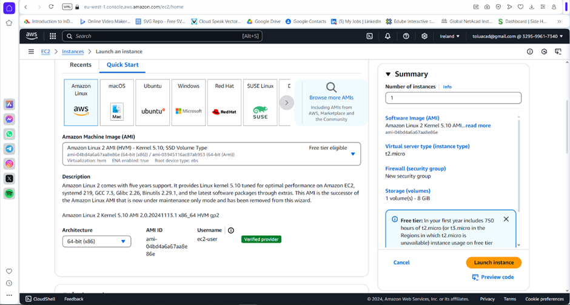

• Selected the t2 micro Instance type

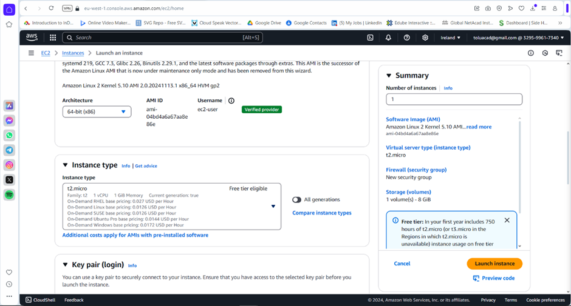

• Created a key pair which was downloaded

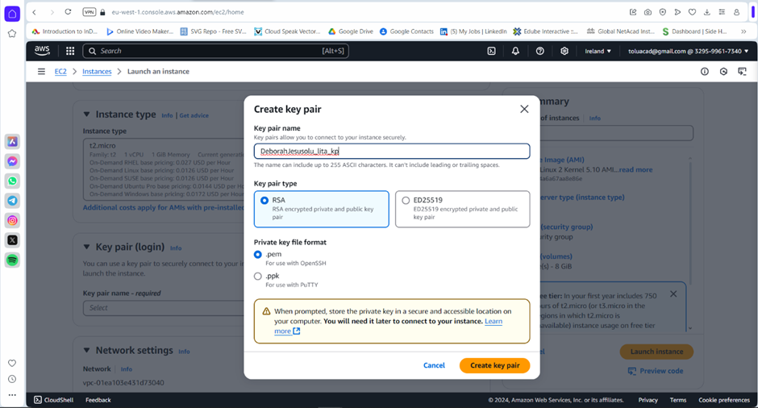

### Network Settings

• I edited my network setting (ensuring that I am not using the default setting)

• Choose the already created lita_project_vpc

• I ensured that a public subnet was selected (so as to ensure that it could be accessed through the internet.

• Auto assign public IP was enabled

### Firewall (Security Group)

• I selected existing security group

• Choose the security group I created earlier

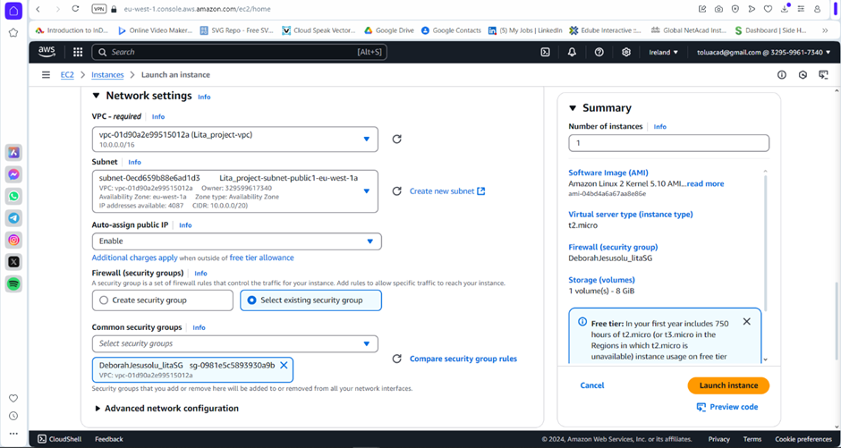

### Configure Storage

• I left my configure storage as it was

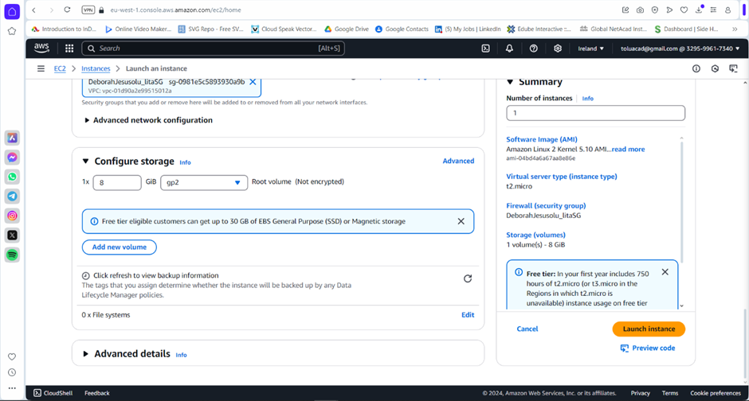

### Final Steps

• I went back to the instance created

• Waited for it to complete initializing

• After obtaining the 2/2 score

• I clicked on that particular instance

• Went to SSH client

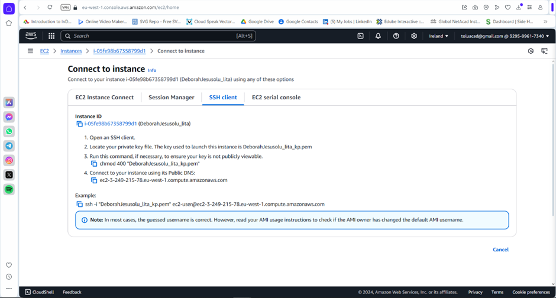

• Copied the code that says “Run this command, if necessary, to ensure your key is not publicly viewable.” To my Gitbash (I opened my gitbash by right clicking on an empty space in my download folder) and clicked on enter

• I thereafter copied the example link containing my key pair, ran it on Gitbash.

• My network was poor, hence brought errors, but it eventually went through, giving the bird like figure

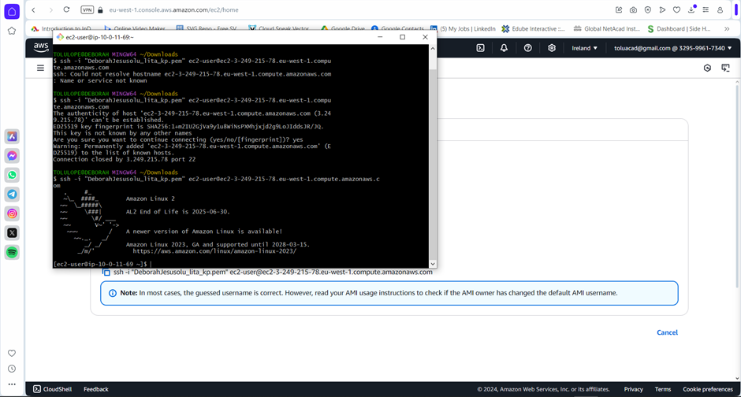

• Typed in “sudo yum update :y” in order to ensure that it is fully updated

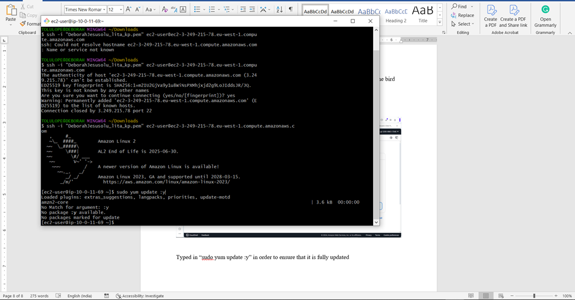

• Then I installed the Apache server by tying “sudo yum install httpd :y”

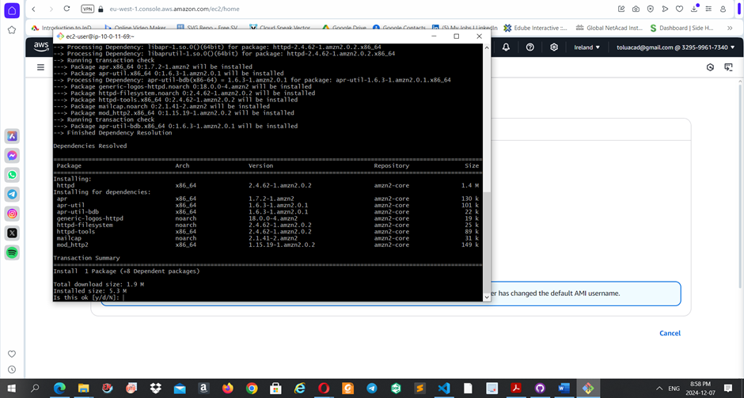

• I typed y, to the question “Is it ok” then it completed running

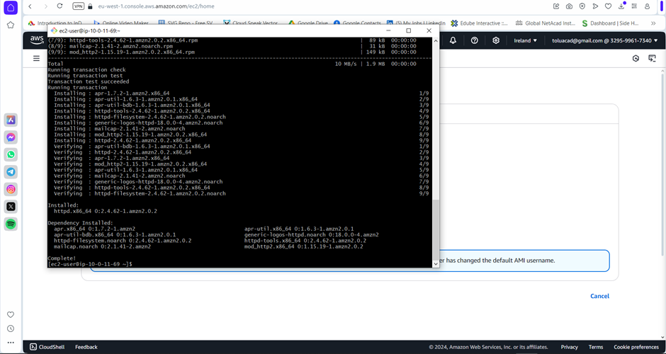

• Typed this codes to start and enable httpd “sudo systemctl start httpd
sudo systemctl enable httpd”

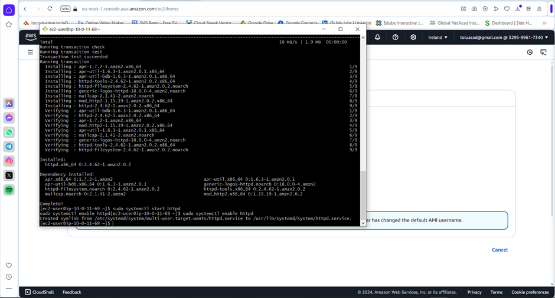

• To ensure that Apache has been successfully installed

• I went to my instance

• Copied the public IP address

• Then pasted it in my browser

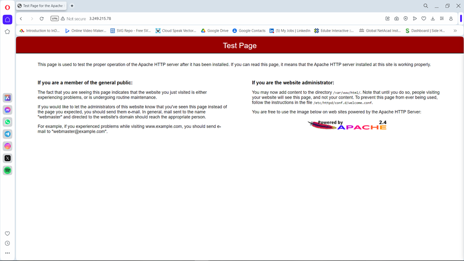

• Finally exited my Gitbash by typing “exit”

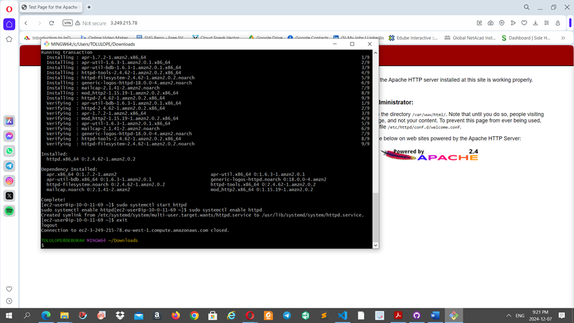
